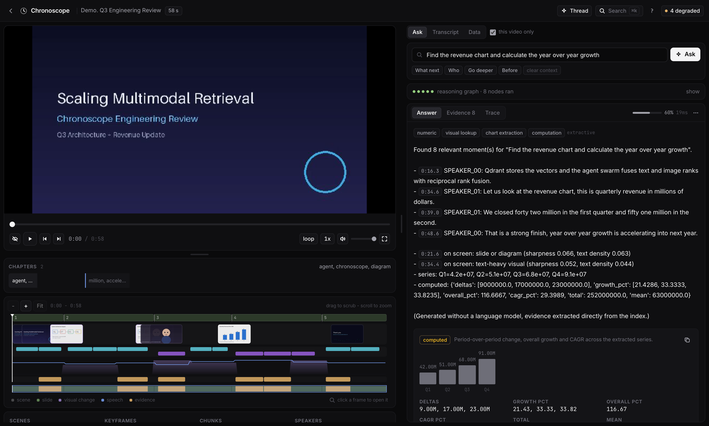
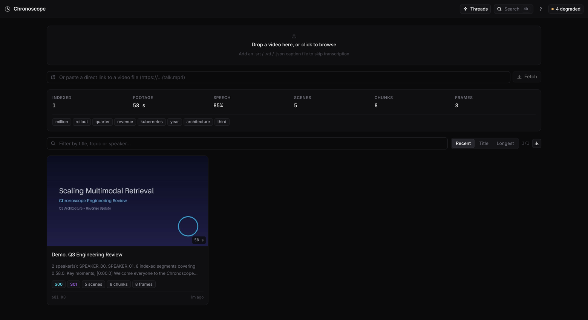
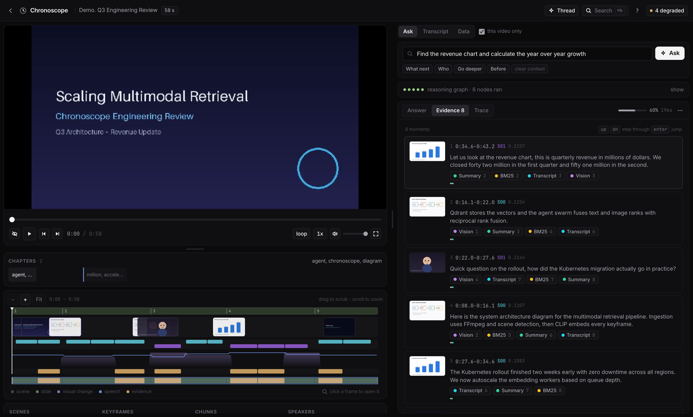
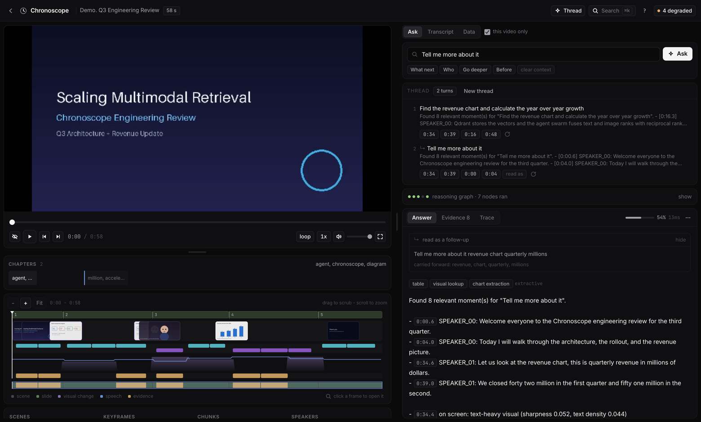

# Chronoscope

Video search and question answering. Chronoscope ingests video, extracts scenes,
speech and keyframes, indexes them together, and answers questions about the
content with timestamps.



## Requirements

- Python 3.11+
- Node 20+
- Docker (optional, for the containerised stack)

## Setup

```bash
make setup
make dev
```

The API runs on `:8000` and the web app on `:5173`.

To try it without supplying a file, open the web app and use the "Load the demo
video" button, which generates a short sample clip and indexes it.

## Docker

```bash
docker compose up -d --build
```

The app is served on `:8080`. Add `--profile llm` to include a local Ollama
container for generated answers, then pull a model:

```bash
docker compose exec ollama ollama pull qwen2.5:7b-instruct
```

## Optional models

The default install runs without any machine learning dependencies, using
lightweight fallbacks for embeddings, transcription and answering. To enable the
full-quality path:

```bash
make setup-ml
```

This installs sentence-transformers, open_clip and faster-whisper. Set
`CS_HF_TOKEN` to enable neural speaker diarisation.

## Configuration

Copy `.env.example` to `.env` and edit as needed. Everything is optional; the
defaults work for local use. Before exposing the service on a network, set at
minimum:

```bash
CS_API_KEY=...          # required for any non-local deployment
CS_ENV=prod
CS_ALLOWED_HOSTS=your.host
CS_CORS_ORIGINS=https://your.host
```

## Usage

Upload a video by dragging it onto the library page. If you have a caption file
(`.srt`, `.vtt` or `.json`), drop it alongside the video and transcription is
skipped.

Once processing finishes, open the video and ask questions in plain language.
Answers include timestamps that seek the player. The Data tab shows scenes,
chunks and keyframes as sortable tables, and any dataset can be exported as
SRT, WebVTT, text, CSV, JSON or a zip of frames.

Questions are grouped into threads, so a follow-up such as "what did they say
right after that?" is read against the previous answer. Past threads can be
reopened from the toolbar.

### Library

Indexed videos, with what was found in each. Files can be dropped in or fetched
from a direct link.



### Evidence

Every moment that was retrieved, and which channels found it. The numbers are
each channel's rank for that moment before the ranks were fused.



### Threads

A follow-up is resolved against the previous turn. The panel shows what the
question was taken to mean and which terms were carried over.



## Development

```bash
make test       # backend test suite
make lint       # ruff, mypy, tsc
make build      # production frontend bundle
make clean
```

## API

Interactive documentation is available at `/api/docs` when the server is
running.

## License

MIT
